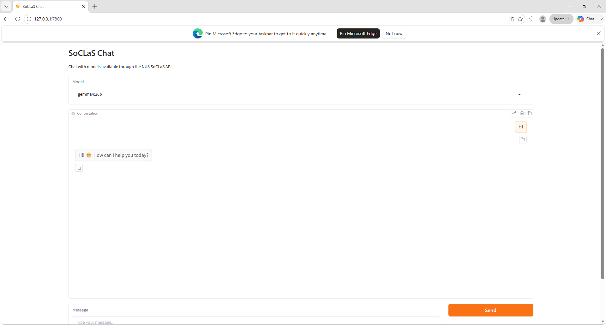
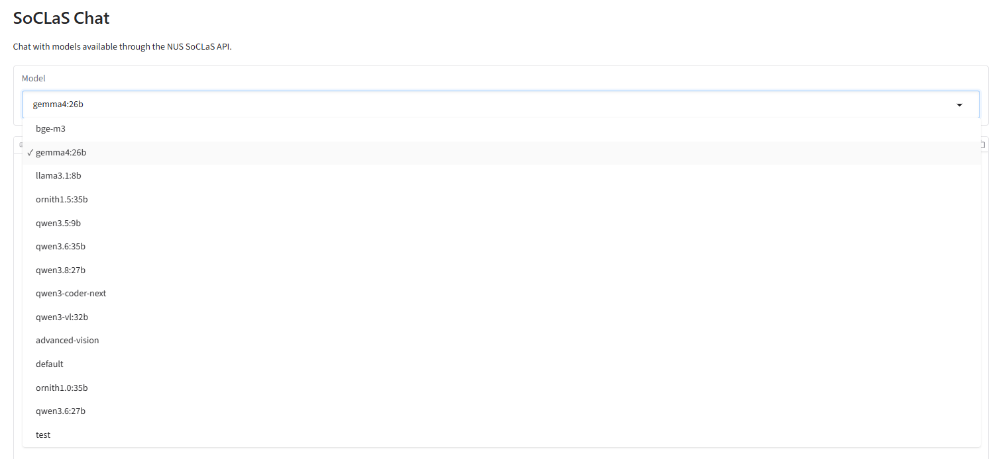
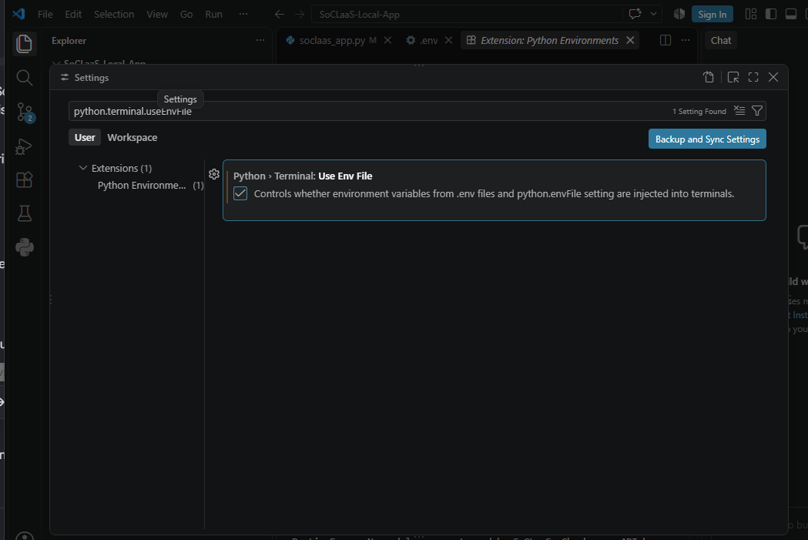

# SoCLaaS Local App
Deploy NUS SoC LLM as a Service locally as an app for easy chatting

# Quick Start for using NUS SoC LLM as a Service in a local applet
1. Create a venv using `python -m venv .venv`
2. Activate venv using `.venv\Scripts\activate`(Windows) or `source .venv/bin/activate`(Linux)
3. Install dependencies using `pip install -r requirements.txt` 
4. Create a env file (.env) containing 
`SOCLAAS_API_KEY="<your api key>"`
`SOCLAAS_BASE_URL="https://soclaas-api.comp.nus.edu.sg/v1"`
5. Run soclaas_app.py
6. Check the Terminal for the link to the local URL which is hosting the applet.

7. Models can be selected from the dropdown menu.

# Note
- Python3.12 is used in this deployment, hence there is a version tagged to gradio. Changing the gradio version would require different gradio api calls.

- The models are hosted on NUS servers. Ensure you are connected to NUS network before running the app.

- As a SoC student, you can obtain your own API key from https://dochub.comp.nus.edu.sg/cf/guides/soclaas/access

- When connecting remotely, you need a VPN. Guide to setup CISCO vpn is here https://nusit.nus.edu.sg/eguides/

- For building your own webapp, refer to docs here https://dochub.comp.nus.edu.sg/cf/guides/soclaas/start

Common Problem
An environment file is configured but terminal environment injection is disabled. Enable "python.terminal.useEnvFile" to use environment variables from .env files in terminals.

This message is a VS Code notification, not a restriction from SoCLaaS. It means VS Code has found your .env file containing your API token, but it is preventing your terminal from reading it for security or configuration reasons.To fix this, you just need to allow VS Code to pass your .env variables into your terminal session.

How to Fix It

Method 1: Click the Notification (Fastest)

If the message is still visible as a popup in the bottom right corner of VS Code, look for a button on it that says "Enable" or "Allow" and click it.

Method 2: Update Your Settings ManuallyOpen VS Code Settings by pressing Ctrl + , (Windows/Linux) or Cmd + , (Mac).In the top search bar, type or paste: python.terminal.useEnvFileLocate the setting labeled Python › Terminal: Use Env File.Check the box to turn it On (set it to true).Important: Close your current terminal window and open a new one (`Ctrl + Shift + ``) for the changes to take effect.
